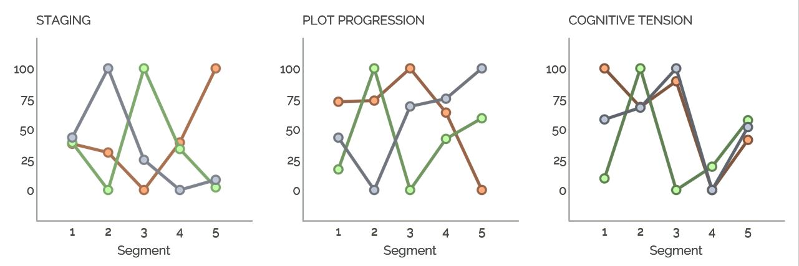

## Comprehensive Analysis of Character-Agency through Computer-based Tools

### Abstract

><i class="fa fa-quote-left fa-2x fa-pull-left fa-border"></i>We tell stories to teach cultural norms,
>to entertain, and to help create shared perspectives (Boyd et al. 1)"

Literature shapes cultural norms and heritage through language. Recent studies focus on gender in text analysis, with computerized methods like NLP offering efficient insights[^1]. Language reflects and reinforces gender stereotypes and power dynamics, but can also be a tool for resistance and subversion. Research shows how linguistic features contribute to maintaining gender-based inequalities. The combination of agency and gender analysis using computerized tools remains relatively unexplored. The thesis aims to investigate the correlation between fictional character agency, gender, and author gender, using the Gutenberg Corpus as research data. By utilizing the tools LIWC, Lingualyzer and BookNLP this research study intents to highlight the difficulties and challenges but also the advatages of using computationalized tools to analyze social concepts like agency.

### Content

<ul class="fa-ul">
  <li><i class="fa-li fa fa-solid fa-arrow-right"></i><a href="#data-and-results">Data and Results</a></li>
  <li><i class="fa-li fa fa-solid fa-arrow-right"></i><a href="#challenges-and-biases">Challenges and Biases</a></li>
  <li><i class="fa-li fa fa-solid fa-arrow-right"></i><a href="#references">References</a></li>
  <li><i class="fa-li fa fa-solid fa-arrow-right"></i><a href="#resources">Resources</a></li>
  <li><i class="fa-li fa fa-solid fa-arrow-right"></i><a href="#contact">Contact</a></li>
</ul>

#### Data and Results

For this study, a small subset of the Gutenberg Project corpus was used, which excluded non-fiction, poetry, drama, and other genres. The focus was solely on novels and short stories. The decision to exclude other genres was based on meta-data and previous research by Nagaraj (2020) to avoid biased or inconclusive results. The subset's adherence to the criteria was verified through random samples, ensuring the study's reliability and validity. Due to limited resources, a focused approach was necessary, and detailed examinations of all authors' texts and genres were eliminated. This method was chosen to ensure a representative and unbiased sample for the study.

<b>LIWC</b>

The Linguistic Inquiry and Word Count (LIWC) software, developed by renowned researcher James W. Pennebaker, is a widely utilized tool in the fields of psychology, sociology, and communication studies for the quantitative analysis of written texts. While LIWC offers invaluable insights, it is important to acknowledge its limitations, such as the presence of predetermined categories and a primary focus on textual content rather than broader contextual or qualitative considerations. Noteworthy features of LIWC include a narrative arc analysis function and the ability to process large volumes of text without the need for prior programming expertise. In essence, LIWC serves as a powerful instrument for examining language usage patterns and their potential impact on human behavior; however, caution must be exercised in its application to ensure the accuracy and reliability of the results.

In my investigation into agency within narrative structures at both macro and micro levels, each text was segmented into five distinct sections utilizing the LIWC software to facilitate a more thorough comparative analysis. The resultant data was then formatted in .csv or .xlsx documents, facilitating the aggregation of findings into a cohesive report. I employed the default English language dictionary within LIWC for further analytical purposes, focusing on a single work per author and producing graphical representations for enhanced interpretation. The outcomes of this analysis shed light on the underlying narrative frameworks present in the selected literary works.

The data obtained reveals a notable discrepancy in the levels of agency displayed by female authors compared to their male counterparts. Specifically, female authors demonstrated a propensity towards employing a greater number of positive emotion words and emotional language overall in their writing. Furthermore, it was observed that female authors maintained a higher average positive tone and a slightly elevated negative tone in their texts as compared to male authors. Interestingly, male authors exhibited a higher frequency of male references, while female authors leaned towards incorporating more female references in their work. Additionally, the analysis highlighted a distinction in pronoun usage between genders, with male authors favoring the use of first-person singular pronouns and female authors displaying a preference for third-person singular pronouns. Notably, both male and female authors employed the pronoun "they" less frequently, albeit with a marginally higher usage rate among male authors.

<b>Lingualyzer</b>

Lingualyzer, a computational linguistic tool developed by Guido M. Linders and Max M. Louwerse with computational implementation from Kiril O. Mitev, is specifically designed for the analysis of multilingual and multidimensional texts. This tool serves as a valuable resource for researchers and analysts seeking to accurately analyze large volumes of text data in various languages, thereby facilitating a more comprehensive understanding of content (Linders and Louwerse 2). Despite some limitations such as the absence of batch processing and a plethora of features that may at times overwhelm users, Lingualyzer prioritizes consistency and usability for commonly used languages. The developers are currently exploring the possibility of incorporating batch processing to cater to a broader audience, as processing documents individually can be inconvenient (Linders and Louwerse 23).
In order to adhere to Lingualyzer's character limit of 40,000, longer text files were segmented using the git bash software with the command git split. Similar to BookNLP, Lingualyzer requires a few minutes for analysis, contingent upon factors like internet connection speed. For this study, a single work per author was selected for analysis due to time constraints. Analysis data from Lingualyzer was made available for download in txt format on the Lingualyzer website and was subsequently imported into Excel for organization and visualization to ensure consistency and ease of manipulation.

The results of the study revealed that texts with lower counts of passive voice tend to exhibit higher agency, particularly evident in works such as Wuthering Heights and The Life and Death of Mr. Badman for female and male authors respectively. Furthermore, the analysis highlighted that novels such as The Tale of Mr. Jeremy Fisher and The Raven had the lowest passive voice counts. Additionally, there were notable variations in verb types, occurrences, and ratios observed across different works, providing insights into the stylistic choices of various authors. For instance, works like Wuthering Heights and The Life and Death of Mr. Badman demonstrated higher verb-noun ratios, indicating a particular emphasis on action within the narrative. Conversely, texts like Brownes Folly and The Tale of Mr. Jeremy Fisher exhibited lower pronoun-noun ratios, suggesting a different approach to character depiction and narrative structure.

<b>BookNLP</b>

In contrast to LIWC and Lingualyzer, the BookNLP pipeline, developed by David Bamman, is tailored for users with a programming background. BookNLP is a natural language processing pipeline specifically designed for the analysis and processing of longer documents, extracting linguistic features such as character names, locations, relationships, and actions to enhance the understanding and analysis of literary texts. Employing a range of language processing techniques like named entity recognition, part-of-speech tagging, and dependency parsing, BookNLP utilizes pre-trained models and data sets focused on long-format texts to enhance the accuracy of analysis. The application of BookNLP spans various research projects in fields such as literary analysis, digital humanities, and text mining, making it freely available for academic and research purposes through its GitHub repository.
During the installation process of BookNLP on Windows, known technical challenges were encountered, leading to the utilization of Google Colab servers for computational analysis. However, limitations on run time and RAM prevented concurrent processing of multiple files, necessitating a sequential analysis on a per-author basis. The appendices contain the code used for configuring and executing BookNLP, with data stored both on Google Drive and the local machine. After data collection, a conversion into XLSX format facilitated statistical interpretation and visualization while generating word clouds for characters based on values of mod, poss, patient, and agent for further analysis in later sections.
Analysis of the BookNLP data indicated a higher prevalence of male characters compared to female characters on average, with female authors favoring female characters and male authors tending towards male characters. Usage of gender-neutral pronouns was limited for both genders, albeit with male authors exhibiting a slightly higher frequency. Notably, a singular occurrence of ze/zem/zir/hir pronouns was identified, likely a false positive. Divergence in results from the BookNLP and LIWC analyses could stem from the relatively small sample size in the former, consisting of a single text per author. Female characters demonstrated a slightly greater dominance in sentences, assuming roles as agents, possessions, and patients, aligning with hypotheses suggesting a higher propensity for females to act as patients over agents.

Specific characters like Fan from William Henry Hudson’s "Fan" scored highest in both agent and patient roles, while Grizel from James Matthew Barrie’s "Tommy and Grizel" excelled in modifier and possessions categories. Negative connotations associated with Grizel contradicted assumptions linking male characters to negative emotions, possibly influenced by findings from the LIWC analysis indicating more negative language usage by male authors. BookNLP's unreliability in accurately classifying first names was evident when Grizel was mistakenly tagged as male, highlighting limitations in gender recognition accuracy. Instances of Fan as an agent linked to intransitive verbs could impact reader comprehension, influencing the concept of agency portrayed in the text. Challenges in interpreting BookNLP results are acknowledged due to the tool's inherent limitations, to be further elaborated on in forthcoming sections. Ultimately, the analysis upholds the initial research hypothesis, revealing distinctions in the creation and comprehension of male and female characters that could spark future research endeavors.
 

### Challenges and Biases

There is no denying the huge benefit of using various computational tools, especial-ly in language and text analysis. The existing methods for person entity recognition and linking in literary texts are often inadequate due to the complex and ambiguous nature of character names and descriptions in narratives. Therefore many researchers search for new approaches that combine older techniques with machine learning algo-rithms specifically trained on literary data (Lajewska and Wróblewska 8–9). Over the last decade, numerous studies have been conducted to explore efficient meth-ods for detecting characters in literary texts and analyzing them, particularly when utilizing a quantitative approach. These studies aim to identify innovative techniques for character detection and analysis that can help with tasks such as sentiment analysis, character relationship mapping, and plot analysis. As the digital age continues to trans-form the way we read and analyze texts, it is crucial to develop more effective tools and techniques that can improve our understanding of literary works (Vala et al. 769).  
Many research studies in the field of natural language processing and artificial intelli-gence focus on developing machine learning algorithms that can effectively process and analyze textual data. These algorithms require a large amount of annotated text data to train on and learn from. This process involves manually labeling a sample of text examples with relevant tags or labels that can help the algorithm identify patterns and make accurate predictions. The quality and quantity of the annotated data are cru-cial factors that can impact the performance and effectiveness of the machine learning algorithm. Therefore, researchers often invest a significant amount of time and effort in creating high-quality annotated datasets to improve the accuracy and reliability of their models (Soni et al. 8–9). But these algorithms and tools are also less than perfect. Human language is a complex construct that is not easy to analyze. While tools like genderize.io are useful for infer-ring gender from first names, their accuracy can be improved by incorporating addi-tional factors or methodologies into the analysis (Sebo, “Using genderize.io to infer the gender of first names: how to improve the accuracy of the inference” 610–11). Conse-quently, the responsibility of ensuring the credibility of the tool still lies on the re-searcher's shoulders. However, this approach can potentially introduce human biases into the process. Paul Sebo’s research article which focuses on evaluating the accuracy and reliability of various name-to-gender inference services begins discussing the limitations and chal-lenges associated with using names as a proxy for gender identification. In today's digi-tal age, gender detection tools are frequently used in various applications such as social media analysis, demographic research, and marketing strategies. However, the effec-tiveness of these tools in accurately determining an individual's gender based solely on their name remains a topic of debate. While certain names may be traditionally associ-ated with a specific gender (e.g., "John" for males), there are many names that are uni-sex or culturally diverse, making it difficult for name-to-gender inference services to accurately assign a gender. This ambiguity can lead to misgendering individuals and perpetuate harmful stereotypes. Sebo emphasizes the importance of critically evaluat-ing the performance of gender detection tools and recognizing their limitations in ac-curately representing gender diversity. The study calls for greater transparency and accountability in the development and implementation of these tools, as well as the need for ongoing research and refinement to improve their accuracy and inclusivity (Sebo, “Performance of gender detection tools: a comparative study of name-to-gender inference services” 419–20). 
To make an example relating to this thesis, the name Grizel was tagged as male by BookNLP, despite it being a female character. This highlights the challenges in break-ing down complex human concepts like agency, identity, and gender into simplified forms that can be processed by algorithms. Even with the best algorithms, inaccuracies are bound to arise, especially if the data is skewed by individual biases. The issue of accessibility when working with computational tools is also important. In this thesis, I have used three different tools, each with its accessibility challenges. While LIWC is a very user-friendly and accessible software, it is unfortunately behind a paywall. This makes it less accessible than Lingualyzer or BookNLP, which are both available for free. However, Lingualyzer is a web-based tool that experiences crashes and server inaccessibilities. Moreover, both Lingualyzer and BookNLP have longer processing times, and Lingualyzer has a character limit that makes it challenging to process larger texts. The subsequent section of this thesis will discuss the various biases that emerge during the process of rating and assessing creative works. Moreover, we will explore the chal-lenges that arise while applying quantitative measures to subjective artistic expression, and how these limitations can affect the accuracy and validity of our assessments. Through our investigation of the multifaceted issues that come with rating and as-sessing creative works, I aim to gain a more profound insight into the complexities involved in evaluating creative works and devise a more objective approach to this process.The first study highlighting this complex topic aims to investigate the effectiveness and accuracy of a computer-analytic developmental scale to measure students' writing ability in assessing students' writing proficiency and developmental progress over time. Traditional methods of assessing writing, such as standardized tests and teacher evalua-tions, have limitations in terms of reliability, consistency, and objectivity. Computer-analytic tools have emerged as a potential solution to these challenges, offering a more efficient and objective way to measure writing ability (Burdick et al. 256). The study presents a developmental scale that uses computer algorithms to analyze and score students' writing samples based on various linguistic features, such as vocabu-lary, sentence structure, coherence, and organization. The scale categorizes students into different proficiency levels, ranging from beginner to advanced, to track their pro-gress and growth in writing skills over time. The results demonstrate a strong correla-tion between the scores produced by the computer-analytic scale and the established measures of writing ability, indicating that the scale is a valid and accurate tool for assessing students' writing skills (Burdick et al. 273–77). Similarly, the article "Differences in Gender and Ethnicity as Measured by Ratings of Three Writing Tasks" by James C. Kaufman, John Baer, and Claudia A. Gentile ex-plores the relationships between gender, ethnicity, and writing performance. The re-searchers conducted a study in which they asked participants to complete three differ-ent writing tasks, which were then rated by a panel of judges. The study aimed to in-vestigate whether gender and ethnicity influenced the quality of writing performance as judged by raters (KAUFMAN et al. 496–98). The study found that there were indeed differences in the ratings of the writing tasks based on both gender and ethnicity. Specifically, female participants were consistently rated higher than male participants across all three tasks. Additionally, there were also differences in the ratings based on ethnicity, with White participants being rated higher than Hispanic participants. The researchers suggest that there may be societal biases and stereotypes that influence how judges perceive and evaluate the writing of differ-ent genders and ethnicities. For example, there may be cultural expectations about the writing abilities of certain groups, leading to differential ratings based on gender and ethnicity. Furthermore, these differences in ratings based on gender and ethnicity may have implications for how individuals are perceived and evaluated in academic and professional settings. If certain groups are consistently rated lower based on factors such as gender or ethnicity, this could have consequences for their educational and career opportunities. The researchers suggest that it is important for educators and evaluators to be aware of these biases and work towards fair and equitable assessments of writing performance (KAUFMAN et al. 508). Kaufman et al. argue that for example, participants tended to rate works created by individuals of their ethnicity or gender more favorably than those created by individu-als from different backgrounds. This suggests that individuals may have a preference for creative works that are more familiar or relatable to them. Second, they found evi-dence of stereotyping in the evaluation of creative works. Participants tended to asso-ciate certain ethnicities and genders with specific creative traits, such as originality or quality. These stereotypes influenced their evaluations, leading to inconsistencies in how works were rated based on the creator's background (KAUFMAN et al. 505–08). The aforementioned research studies have revealed that the presence of biases can sig-nificantly affect the evaluation of creative works, leading to subjective and unfair as-sessments that can impact the outcome. However, in this thesis, the author has taken a proactive approach to mitigate these biases by utilizing computational tools. These tools can aid in reducing subjectivity and ensure the evaluation process is objective, fair, and accurate. By leveraging the power of technology, the author has attempted to address the impact of human biases on the assessment of creative works, guaranteeing that the outcomes are more reliable and trustworthy.

### References

Back up your stuff with solid, clean citations. Footnotes can be written in markdown and appear like this.[^1] Use as many as you like.[^2]

#### Resources

<i class="fa-regular fa-scroll fa-3x fa-pull-left"></i>

[Project Repository](https://gitlab.rlp.net/limmerhe/decoding-gender-in-fictional-character-development)\
[LIWC](https://www.liwc.app/)\
[Lingualyzer](https://lingualyzer.com)\
[BookNLP](https://github.com/booknlp/booknlp)

### Contact

#### Lisa Immerheiser (she/her)



This website was created  as part of a master thesis at the Johannes Gutenberg-Universität Mainz within the degree program Digital Humanities (Digitale Methodik in den Geistes- und Kulturwissenschaften)

### Footnotes

[^1] ref studies