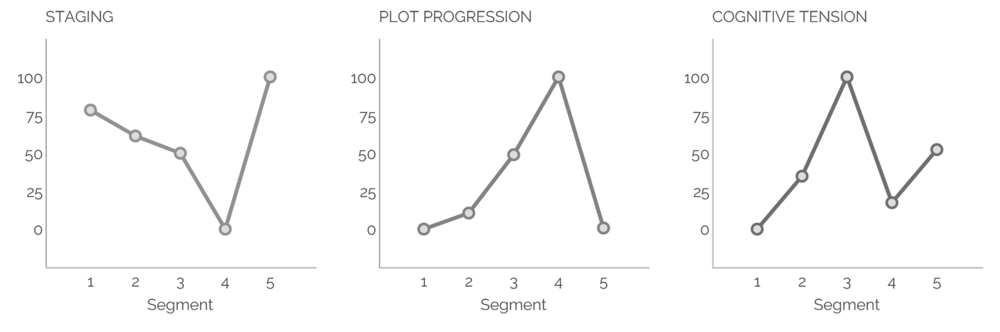

## Comprehensive Analysis of Character-Agency through Computer-based Tools

### Abstract

><i class="fa fa-quote-left fa-2x fa-pull-left fa-border"></i>We tell stories to teach cultural norms,
>to entertain, and to help create shared perspectives (Boyd et al. 1)"

Literature shapes cultural norms and heritage through language. Recent studies focus on gender in text analysis, with computerized methods like NLP offering efficient insights (xxx). Language reflects and reinforces gender stereotypes and power dynamics, but can also be a tool for resistance and subversion. Research shows how linguistic features contribute to maintaining gender-based inequalities. The combination of agency and gender analysis using computerized tools remains relatively unexplored. The thesis aims to investigate the correlation between fictional character agency, gender, and author gender, using the Gutenberg Corpus as research data. By utilizing the tools LIWC, Lingualyzer and BookNLP this research study intents to highlight the difficulties and challenges but also the advatages of using computationalized tools to analyze social concepts like agency.

### Content

<ul class="fa-ul">
  <li><i class="fa-li fa fa-solid fa-arrow-right"></i><a href="#data-and-results">Data and Results</a></li>
  <li><i class="fa-li fa fa-solid fa-arrow-right"></i>Challenges and Biases</li>
  <li><i class="fa-li fa fa-solid fa-arrow-right"></i>References</li>
  <li><i class="fa-li fa fa-solid fa-arrow-right"></i>Resources</li>
  <li><i class="fa-li fa fa-solid fa-arrow-right"></i>Contact</li>
</ul>

#### Data and Results

This thesis used a small subset of the Gutenberg Project corpus, excluding non-fiction, poetry, drama, and other texts to focus on novels and short stories. This decision was based on meta-data and previous research by Nagaraj (XXX). Excluding other genres was important to avoid biased or inconclusive results. Random samples were taken to verify the subset's adherence to the criteria, ensuring the study's reliability and validity. The limited resources for the thesis necessitated a focused approach, eliminating time-consuming detailed examinations of all authors' texts and genres. This method was chosen to ensure a representative and unbiased sample for the study.
The Linguistic Inquiry and Word Count (LIWC) software, created by James W. Pennebaker, is widely used in psychology, sociology, and communication studies to analyze written texts quantitatively. While valuable, it has limitations such as predetermined categories and a focus on textual content rather than context or significance. Some features include a narrative arc analysis tool and the ability to process lagre amounts of texts with no prior programmin knowledge. Overall, LIWC can provide valuable insights into language usage and its effects on behavior, but should be used carefully to ensure accurate and reliable results.

To conduct my analysis on agency in narrative structures as well as on a lexical level, I divided each file into five sections using LIWC software for a more comprehensive comparison. The results were generated in .csv or .xlsx format, making it easy to combine them into a single document. The default English language dictionary in LIWC was used for further analysis. One work per author was chosen for analysis, with the data compiled into xlsx format and a graph for interpretation. The results provided insights into the narrative structures of the selected works.
The data indicates that female authors demonstrate a significantly higher level of agency in their writing compared to male authors, on average. The data indicates that, on average, female authors tend to use more positive emotion words and emotion words in general than male authors. Additionally, female authors tend to have a higher average positive tone than male authors but also have a higher negative tone on average. The findings reveal that male authors tend to use more male references, whereas fe-male authors tend to use more female references. Additionally, male authors use the first-person singular pronouns more frequently, while female authors prefer using the third-person singular. Both genders use the pronoun "they" less frequently, but the av-erage usage is slightly higher for males.

The results of the analysis revealed that there is a strong correlation between the de-gree of plot progression and the level of agency. This suggests that the more agency a character has, the more likely they are to drive the plot forward.
Conversely, the analysis also revealed a negative correlation between the level of stag-ing and agency. This means that the more a story is involved in setting the stage for events, the less agency the characters typically have.
Interestingly, the assumption that agency peaks when cognitive tension peaks was not supported by the evidence. While higher cognitive tension can lead to increased agen-cy in some cases, it is not a definitive predictor of agency levels. This could be at-tributed to the small sample size and is something that may be worth investigating in further research.
However, it is important to note that this methodology has its limitations. While it can help us identify patterns and trends in the overall narrative structure, it may not be suf-ficient to derive inferences at the individual character level. Additionally, the modest sample size may restrict its representativeness and we may not be able to generalize our findings to a larger population of stories. 
Overall, the findings of the LIWC analysis suggest that there is a significant distinction between the overall works of male and female authors regarding agency on a lexical level. As for the narrative arc analysis, a larger sample size or a more qualitative ap-proach might yield more impressive results Lingualyzer developed by Guido M. Linders and Max M. Louwerse with computa-tional implementation from Kiril O. Mitev is a new computational linguistic that is designed for analyzing multilingual and multidimensional texts. The tool was devel-oped to help researchers and analysts accurately analyze large amounts of text data in various languages, allowing for a more comprehensive understanding of the content (Linders and Louwerse 2). While Lingualyzer has limitations like a lack of batch processing, a large number of features that can sometimes overwhelm users, and coverage of only a small percentage of languages, it focuses on consistency and usability for the most commonly used lan-guages. The developers currently are looking into allowing batch processing for a wid-er audience, which would be a welcome addition as processing each document individ-ually is rather inconvenient (Linders and Louwerse 23).
To comply with Lingualyzer's character limit of 40,000, I had to segment longer text files. I used git bash and the command git split to divide the files into equal parts. Similar to BookNLP, Lingualyzer takes a few minutes to analyze, depending on factors such as internet connection. For the purpose of this study, I chose to analyze only one work per author, given the time constraints. The Lingualyzer website provides the analysis data for download in txt format, which I imported into Excel for organization and visualization to ensure consistency and ease of manipulation. The subsequent segment of the study examined the outcomes of the Lingualyzer analysis. The LIWC analysis does not show any of the previously mentioned texts as having high or low agency. However, from a grammatical perspective, one can assume that a text with more complex verb forms and a lower passive count indicates higher agency. In the English language, passive voice is often used to draw attention to the action it-self or the patient (BUDWIG 1247). Leading to the assumption that texts with a lower passive count tend to focus more on the agent and can be therefore assumed to be more agentive.
The results indicate that the highest passive count was found in Wuthering Heights and The Life and Death of Mr. Badman for female and male authors, respectively. The lowest passive count was found in The Tale of Mr. Jeremy Fisher for female authors and The Raven for male authors, except for the lowest passive incidence per sentence on average was found in The Love of Ulrich Nebendahl. In addition, based on the data, it is evident that the novels Wuthering Heights and The Life and Death of Mr. Badman have the highest count of verb types and verb occur-rences. On the other hand, The Tale of Mr. Jeremy Fisher has the lowest count of verb types and verb occurrences, followed by Brownes Folly, which has the lowest count of verb types and verb occurrences overall. Additionally, The Gift of the Magi has the lowest verb count and verb type count per sentence on average. Furthermore, Wuther-ing Heights and The Life and Death of Mr. Badman had the highest verb-noun ratio, while the lowest verb-noun ratio was observed in The Tale of Mr. Jeremy Fisher and Brownes Folly. Similarly, the highest pronoun-noun ratio was found also in Wuthering Heights and The Life and Death of Mr. Badman, whereas the lowest pronoun-noun ratio was observed in Brownes Folly and The Tale of Mr. Jeremy Fisher.
In contrast to LIWC and Lingualyzer, the BookNLP pipeline developed by David Bamman is intended for users with a background in programming. BookNLP is a natu-ral language processing pipeline that is designed specifically for analyzing and pro-cessing longer documents. It can be used to extract various linguistic features and in-formation from text, such as character names, locations, relationships, and actions, in order to better understand and analyze the content of a book. BookNLP offers a combi-nation of language processing techniques, including named entity recognition, part-of-speech tagging, and dependency parsing, to analyze the text and extract relevant in-formation. It also includes a number of pre-trained models and data sets that have been specifically trained on long-format texts to improve the accuracy of the analysis (GitHub). BookNLP has been used in various research projects and applications, such as literary analysis, digital humanities, and text mining. It is freely available for academic and research purposes and can be accessed and used through its GitHub repository (GitHub). 
During my attempts to install BookNLP on Windows, I faced several known technical difficulties. As a result, I decided to utilize Google Colab servers for computational analysis instead. However, due to restrictions concerning the run time and RAM, run-ning multiple files simultaneously was not possible, therefore I had to analyze one work per author sequentially. Each analysis took approximately 10 to 20 minutes to complete. The appendix contains the code used to configure and execute BookNLP. All the data collected was stored both on Google Drive and on my local machine. After data collection, I converted the data into an XLSX format for statistical interpretation and visualization purposes. Furthermore, I created word clouds for each character in the work that represented the values of mod, poss, patient, and agent. I will delve deep-er into the implications of these findings in sections 5 and 6. 
In the BookNLP data, it was observed that, on average, there are more male characters than female characters. Furthermore, it was found that female authors tend to write more female characters, while male authors prefer male characters. The use of gender-neutral pronouns for their characters is comparatively low for both gen-ders but male authors use more gender-neutral pronouns on average. What is interest-ing about the data is that there was one occurrence of ze/zem/zir/hir pronouns which is likely to be a false positive. It is important to highlight that the results obtained from the BookNLP analysis differ from those obtained from the LIWC analysis. This could be attributed to the fact that the sample size for the BookNLP analysis was relatively small, as only one text per author was used in the analysis. According to the data analysis, female characters were found to be slightly more domi-nant in sentences as agents had more possessions and also acted more as patients. This aligns with the hypothesis suggesting that women are generally more likely to act as patient than agent (Formanowicz et al. 566). Additionally, the character Fan from William Henry Hudson’s Fan was ranked the highest in terms of being an agent and patient, while Grizel from James Matthew Bar-rie’s Tommy and Grizel was ranked the highest in terms of modifier and possessions. The modifiers used to describe Grizel in the analyzed text displays a slightly negative connotation, which goes against the assumption that male characters are usually asso-ciated with negative emotions. However, the LIWC analysis revealed that male authors tend to use more negative language, which could explain this finding. Additionally, the high frequency of body part references in possessions associated with Grizel could be attributed to her role as the protagonist's love interest. It's worth mentioning that BookNLP is not reliable in classifying first names. For instance, it tagged Grizel as male, indicating the algorithm's unreliability to recognize gender accurately in such cases. One interesting observation of Fan as an agent to a verb in a sentence is that it often involves intransitive verbs. Intransitive verbs can have an impact on the reader's com-prehension of a text (Bornkessel‐Schlesewsky and Schlesewsky 53–55) which in turn can be crucial to the concept of agency portrayed in the work. The findings presented above are somewhat challenging to interpret as BookNLP, like most NLP tools, is not always entirely reliable in its results. However, this issue will be discussed in more detail in the upcoming chapter. Nonetheless, the BookNLP analysis confirms the hypothesis postulated at the beginning of this research. Although measur-ing agency might be challenging, there are methods to achieve it. Furthermore, it demonstrates that there is, in fact, a distinction between the creation and comprehen-sion of male and female characters. This finding can serve as a starting point for future research.

### Challenges and Biases

There is no denying the huge benefit of using various computational tools, especial-ly in language and text analysis. The existing methods for person entity recognition and linking in literary texts are often inadequate due to the complex and ambiguous nature of character names and descriptions in narratives. Therefore many researchers search for new approaches that combine older techniques with machine learning algo-rithms specifically trained on literary data (Lajewska and Wróblewska 8–9). Over the last decade, numerous studies have been conducted to explore efficient meth-ods for detecting characters in literary texts and analyzing them, particularly when utilizing a quantitative approach. These studies aim to identify innovative techniques for character detection and analysis that can help with tasks such as sentiment analysis, character relationship mapping, and plot analysis. As the digital age continues to trans-form the way we read and analyze texts, it is crucial to develop more effective tools and techniques that can improve our understanding of literary works (Vala et al. 769).  
Many research studies in the field of natural language processing and artificial intelli-gence focus on developing machine learning algorithms that can effectively process and analyze textual data. These algorithms require a large amount of annotated text data to train on and learn from. This process involves manually labeling a sample of text examples with relevant tags or labels that can help the algorithm identify patterns and make accurate predictions. The quality and quantity of the annotated data are cru-cial factors that can impact the performance and effectiveness of the machine learning algorithm. Therefore, researchers often invest a significant amount of time and effort in creating high-quality annotated datasets to improve the accuracy and reliability of their models (Soni et al. 8–9). But these algorithms and tools are also less than perfect. Human language is a complex construct that is not easy to analyze. While tools like genderize.io are useful for infer-ring gender from first names, their accuracy can be improved by incorporating addi-tional factors or methodologies into the analysis (Sebo, “Using genderize.io to infer the gender of first names: how to improve the accuracy of the inference” 610–11). Conse-quently, the responsibility of ensuring the credibility of the tool still lies on the re-searcher's shoulders. However, this approach can potentially introduce human biases into the process. Paul Sebo’s research article which focuses on evaluating the accuracy and reliability of various name-to-gender inference services begins discussing the limitations and chal-lenges associated with using names as a proxy for gender identification. In today's digi-tal age, gender detection tools are frequently used in various applications such as social media analysis, demographic research, and marketing strategies. However, the effec-tiveness of these tools in accurately determining an individual's gender based solely on their name remains a topic of debate. While certain names may be traditionally associ-ated with a specific gender (e.g., "John" for males), there are many names that are uni-sex or culturally diverse, making it difficult for name-to-gender inference services to accurately assign a gender. This ambiguity can lead to misgendering individuals and perpetuate harmful stereotypes. Sebo emphasizes the importance of critically evaluat-ing the performance of gender detection tools and recognizing their limitations in ac-curately representing gender diversity. The study calls for greater transparency and accountability in the development and implementation of these tools, as well as the need for ongoing research and refinement to improve their accuracy and inclusivity (Sebo, “Performance of gender detection tools: a comparative study of name-to-gender inference services” 419–20). 
To make an example relating to this thesis, the name Grizel was tagged as male by BookNLP, despite it being a female character. This highlights the challenges in break-ing down complex human concepts like agency, identity, and gender into simplified forms that can be processed by algorithms. Even with the best algorithms, inaccuracies are bound to arise, especially if the data is skewed by individual biases. The issue of accessibility when working with computational tools is also important. In this thesis, I have used three different tools, each with its accessibility challenges. While LIWC is a very user-friendly and accessible software, it is unfortunately behind a paywall. This makes it less accessible than Lingualyzer or BookNLP, which are both available for free. However, Lingualyzer is a web-based tool that experiences crashes and server inaccessibilities. Moreover, both Lingualyzer and BookNLP have longer processing times, and Lingualyzer has a character limit that makes it challenging to process larger texts. The subsequent section of this thesis will discuss the various biases that emerge during the process of rating and assessing creative works. Moreover, we will explore the chal-lenges that arise while applying quantitative measures to subjective artistic expression, and how these limitations can affect the accuracy and validity of our assessments. Through our investigation of the multifaceted issues that come with rating and as-sessing creative works, I aim to gain a more profound insight into the complexities involved in evaluating creative works and devise a more objective approach to this process.The first study highlighting this complex topic aims to investigate the effectiveness and accuracy of a computer-analytic developmental scale to measure students' writing ability in assessing students' writing proficiency and developmental progress over time. Traditional methods of assessing writing, such as standardized tests and teacher evalua-tions, have limitations in terms of reliability, consistency, and objectivity. Computer-analytic tools have emerged as a potential solution to these challenges, offering a more efficient and objective way to measure writing ability (Burdick et al. 256). The study presents a developmental scale that uses computer algorithms to analyze and score students' writing samples based on various linguistic features, such as vocabu-lary, sentence structure, coherence, and organization. The scale categorizes students into different proficiency levels, ranging from beginner to advanced, to track their pro-gress and growth in writing skills over time. The results demonstrate a strong correla-tion between the scores produced by the computer-analytic scale and the established measures of writing ability, indicating that the scale is a valid and accurate tool for assessing students' writing skills (Burdick et al. 273–77). Similarly, the article "Differences in Gender and Ethnicity as Measured by Ratings of Three Writing Tasks" by James C. Kaufman, John Baer, and Claudia A. Gentile ex-plores the relationships between gender, ethnicity, and writing performance. The re-searchers conducted a study in which they asked participants to complete three differ-ent writing tasks, which were then rated by a panel of judges. The study aimed to in-vestigate whether gender and ethnicity influenced the quality of writing performance as judged by raters (KAUFMAN et al. 496–98). The study found that there were indeed differences in the ratings of the writing tasks based on both gender and ethnicity. Specifically, female participants were consistently rated higher than male participants across all three tasks. Additionally, there were also differences in the ratings based on ethnicity, with White participants being rated higher than Hispanic participants. The researchers suggest that there may be societal biases and stereotypes that influence how judges perceive and evaluate the writing of differ-ent genders and ethnicities. For example, there may be cultural expectations about the writing abilities of certain groups, leading to differential ratings based on gender and ethnicity. Furthermore, these differences in ratings based on gender and ethnicity may have implications for how individuals are perceived and evaluated in academic and professional settings. If certain groups are consistently rated lower based on factors such as gender or ethnicity, this could have consequences for their educational and career opportunities. The researchers suggest that it is important for educators and evaluators to be aware of these biases and work towards fair and equitable assessments of writing performance (KAUFMAN et al. 508). Kaufman et al. argue that for example, participants tended to rate works created by individuals of their ethnicity or gender more favorably than those created by individu-als from different backgrounds. This suggests that individuals may have a preference for creative works that are more familiar or relatable to them. Second, they found evi-dence of stereotyping in the evaluation of creative works. Participants tended to asso-ciate certain ethnicities and genders with specific creative traits, such as originality or quality. These stereotypes influenced their evaluations, leading to inconsistencies in how works were rated based on the creator's background (KAUFMAN et al. 505–08). The aforementioned research studies have revealed that the presence of biases can sig-nificantly affect the evaluation of creative works, leading to subjective and unfair as-sessments that can impact the outcome. However, in this thesis, the author has taken a proactive approach to mitigate these biases by utilizing computational tools. These tools can aid in reducing subjectivity and ensure the evaluation process is objective, fair, and accurate. By leveraging the power of technology, the author has attempted to address the impact of human biases on the assessment of creative works, guaranteeing that the outcomes are more reliable and trustworthy.

### References

Back up your stuff with solid, clean citations. Footnotes can be written in markdown and appear like this.[^1] Use as many as you like.[^2]

#### Resources

<i class="fa-regular fa-scroll fa-3x fa-pull-left"></i>

[Project Repository](https://gitlab.rlp.net/limmerhe/decoding-gender-in-fictional-character-development)\
[LIWC](https://www.liwc.app/)\
[Lingualyzer](https://lingualyzer.com)\
[BookNLP](https://github.com/booknlp/booknlp)

### Contact

#### Lisa Immerheiser (she/her)



This website was created  as part of a master thesis at the Johannes Gutenberg-Universität Mainz within the degree program Digital Humanities (Digitale Methodik in den Geistes- und Kulturwissenschaften)

### Extra

 Now you can use all the cool icons you want! [Font Awesome](http://fontawesome.io)

<ul class="fa-ul">
  <li><i class="fa-li fa fa-spinner fa-spin"></i>Data</li>
  <li><i class="fa-li fa fa-check-square"></i>you can make lists...</li>
  <li><i class="fa-li fa fa-check-square-o"></i>with cool icons like this,</li>
  <li><i class="fa-li fa fa-spinner fa-spin"></i>even ones that move!</li>
</ul>

If you need them, you can stick any of the [605 icons](http://fontawesome.io/icons/) anywhere, with any size you like. ([See documentation](http://fontawesome.io/examples/))

### Extra

Images play nicely with this template as well. Add diagrams or charts to make your point, and the template will fit them in appropriately.

Lorem ipsum dolor sit amet, consectetur adipiscing elit, sed do eiusmod tempor incididunt ut labore et dolore magna aliqua. Ut enim ad minim veniam, quis nostrud exercitation ullamco laboris nisi ut aliquip ex ea commodo consequat. Duis aute irure dolor in reprehenderit in voluptate velit esse cillum dolore eu fugiat nulla pariatur. Excepteur sint occaecat cupidatat non proident, sunt in culpa qui officia deserunt mollit anim id est laborum.

Thanks to [Shu Uesengi](https://github.com/chibicode) for inspiring and providing the base for this template with his excellent work, [solo](https://github.com/chibicode).

##### Extra:

[^1]: This is a footnote. Click to return.

[^2]: Here is another.
